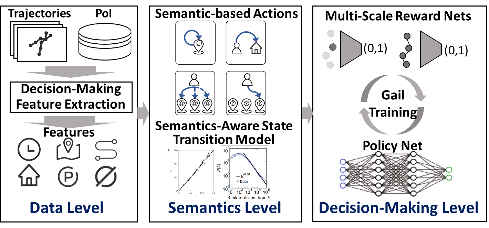

# GeoGail

A novel imitation learning based method to synthesize human trajectories. 


## Table of Contents

- [Background](#background)
- [Install](#install)
- [Usage](#usage)
	- [Data](#data)
	- [Model](#model)
	- [Quantiazationmethod](#quantiazationmethod)
- [Contributors](#contributors)
- [License](#license)

## Background

Synthetic human trajectories are instrumental for a wide-range of applications, including network service optimization, transportation scheduling, etc.For example, in cellular networks, based on synthesized trajectories, we can simulate the detailed process of movement and communication of network users to have a reliable performance analysis of the network. Similarly, we can simulate the traffic congestion before and after the implementation of certain policies (e.g., road expansion) based on synthetic human trajectories, which are crucial for urban plannin

However, synthesizing human trajectories is also challenging due to the complicated spatio-temporal correlation, and large stochasticity of the mobility trajectories. The rise of the deep learning paradigm provides promising solutions to synthesize high-quality human trajectories, where the most successful and prominent methods are based on the generative adversarial network (GAN). Specifically,  GAN utilizes a generator to synthesize new data, and a discriminator to distinguish generated data and real data. Then, it is trained through a mutual game between the generator network and the discriminator network. Utilizing the strong modeling ability of GAN, existing approaches combine it with CNNand RNN to synthesize human trajectories. However, human trajectories are generated by the complicated human decision-making process, while GAN is designed to directly learn the data distribution from demonstrations without modeling the hidden decision-making process, leading to its weakness including the frequent mode collapse, lack of interpretability, and under-performance on unseen data.

## Install

This project uses pytorch and jyupter notebook. Go check them out if you don't have them locally installed.


## Usage

This is only a documentation package.


### Data

you can download the data on the MSRA website GEOLIFE by click this link

https://www.microsoft.com/en-us/download/details.aspx?id=52367&from=https%3A%2F%2Fresearch.microsoft.com%2Fen-us%2Fdownloads%2Fb16d359d-d164-469e-9fd4-daa38f2b2e13%2F

### Model

This model utilizes a novel semantics-based interaction mechanism between the decision-making strategy and visitations to diverse geographical locations to model them in the semantic domain in a uniform manner. To augment the modeling ability to the real-world human decision-making policy, we propose a feature extraction model to extract the internal latent factors of variation of different individuals. Further, to better reward users' mobility behavior, we propose a novel multi-scale reward net combined with mutual information to model the instant reward, long-term reward, and individual characteristics in a cohesive manner.


### Run the whole program
```sh
$ python run.py
```

### Contributors

This project exists thanks to all the people who contribute. 

## License

[MIT](LICENSE)
